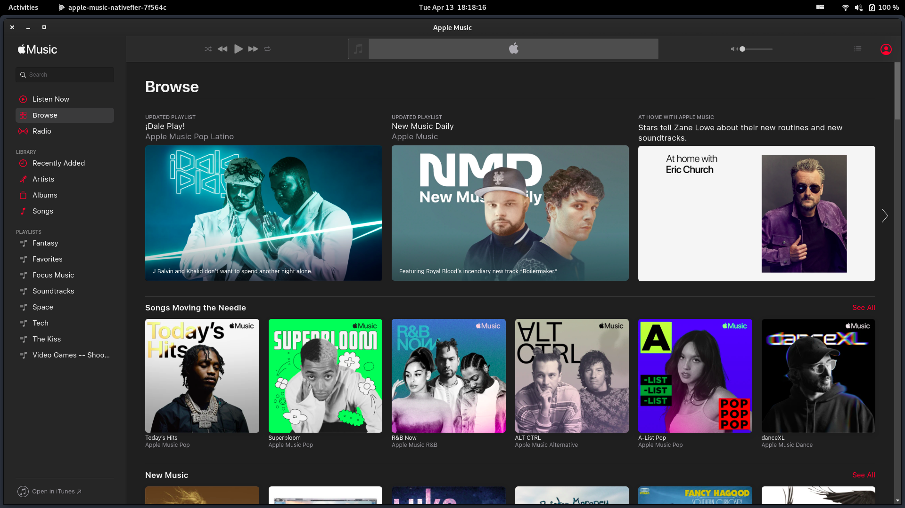

This setup isn't entirely necessary because you can just use [Apple Music's web player](https://music.apple.com) in any browser that supports playing DRM protected content. However, I like having a more native experience with Apple Music on Linux (and Windows) so I will provide a short snippet on how to create an Electron app for Apple Music using [Nativefier](https://github.com/nativefier/nativefier). On top of that, I use Nativefier all the time and I don't think it's as popular or widely-used as it could be.

P.S. you can use this method for any web application that doesn't have a native app and you can use `nativefier` on any platform.

### Install Nativefier:

Install Nativefier using `npm`:

```bash
sudo npm install -g nativefier
```

### Create an Electron wrapper for Apple Music:

Use the following command to create an application bundle for Apple Music:

```bash
nativefier --name "apple-music" --widevine https://music.apple.com
```

Let's move the newly created application bundle to the `/opt` directory:

```bash
sudo mv apple-music* /opt/apple-music
```

### Create a desktop file for Apple Music:

Now, let's create a `.desktop` file for the Apple Music bundle so that way your desktop environment can pick it up and launch it.

Create a new file in `/usr/share/applications/apple-music.desktop` with the following content:

```
[Desktop Entry]
Type=Application
Name="Apple Music"
GenericName=music
Exec=/opt/apple-music/apple-music
Categories=Music;Entertainment;
```

You can also create a symlink to place the `apple-music` executable in your `$PATH`:

```bash
sudo ln -s /opt/apple-music/apple-music /usr/local/bin/apple-music
```

### Launch the app:

Use your preferred launcher to open the Apple Music or run the executable from the command line:

```bash
apple-music
```

Here's what Apple Music via Nativefier looks like on GNOME 40:


