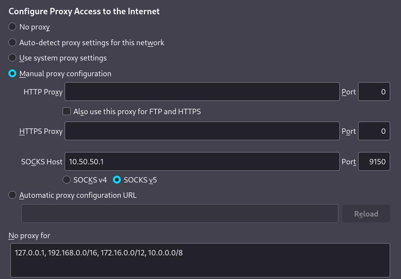
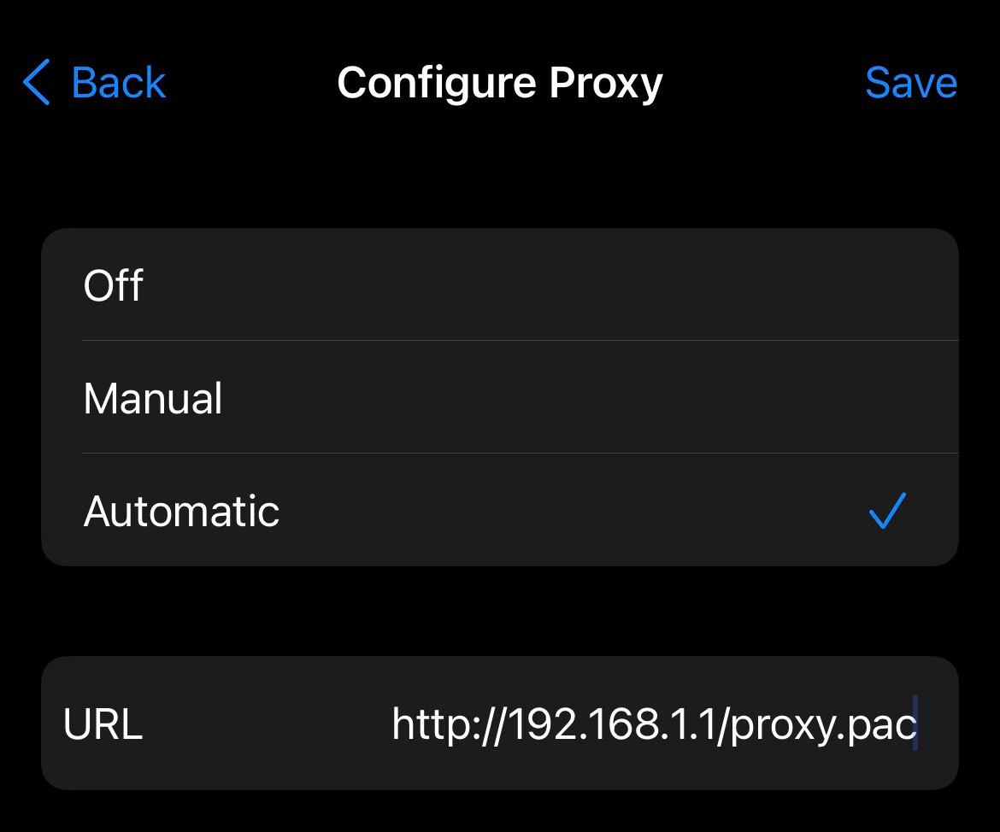
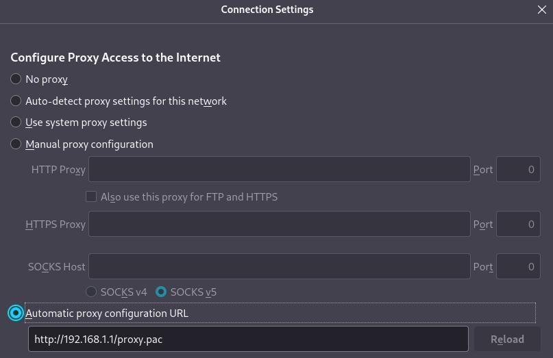

_Edit: I added a section to show how to use the `torrc` file in the container and how to specify which country code your entry/exit nodes would be based in (for speed)._

Apple's [Private Relay](https://www.apple.com/newsroom/2021/06/apple-advances-its-privacy-leadership-with-ios-15-ipados-15-macos-monterey-and-watchos-8/) is a pretty awesome concept. As I understand it, it's pretty much a faster version of the Tor network (as it only jumps through two nodes) that is managed by Apple and easily toggle-able in the Settings app. I don't know if they are actually using the Tor protocol but I can assume they are as their description of Private Relay matches up pretty closely to my understanding of Tor.

The upsides of using the Private Relay:
- It's an easy button for private browsing.
- When it works, it is faster than Tor and has most of the same benefits.
- Private Relay doesn't proxy private IP space. This means you can use Safari+Private Relay to privately browse the internet and still access your router at home (or other resources on your LAN).

Those are big upsides.

At the time of me writing this, there are a couple of really big downsides to Apple's Private Relay:
- It's super unstable (in Apple's defense iOS 15 is still in beta) -- Safari pretty much doesn't work for me at all if I have the Private Relay turned on.
- It's exclusive to Apple products -- you can't even use Private Relay with third party apps on your Apple device.
- Since you can't specify which apps use the Private Relay it really only provides privacy when browsing in Safari or using other Apple apps. I really don't use any of the Apple apps except Safari on my phone so the Private Relay doesn't do much for all the other non-Apple apps I use.

After some thought, I just decided to see if I can work around these downsides using Tor. However, I don't want to use the Tor Browser because one of my favorite upsides of the Safari + Private Relay is that I can still access all my devices in private IP space without having to turn off Private Relay. 


## Requirements:

To replicate my setup you need a Linux server. I keep my devices always-connected to a VPS running Wireguard and so I'm using that same Wireguard connection and VPS to run my proxy.

[Install Docker](https://docs.docker.com/get-docker/) on your server.


## Installation:

### SOCKS Proxy:

First, let's setup a Tor SOCKS proxy. This will allow you to point your desktop browsers directly at your SOCKS proxy which will allow them to use Tor.

Run the following Docker command to use the [PeterDaveHello/tor-socks-proxy](https://github.com/PeterDaveHello/tor-socks-proxy) image:

```bash
docker run -d --restart=always --name tor-socks-proxy -p 9150:9150/tcp peterdavehello/tor-socks-proxy:latest
```

I won't go into detail on how to do this but I'd recommend restricting that port with a firewall to make sure that only specific IP addresses can use the SOCKS proxy.

My server's IP address where I will connect to the proxy is 10.50.50.1. You can configure Firefox to use the proxy in Settings > General > Network Settings > Settings > Manual Proxy Configuration. Refer to the screenshot below for specifics -- I would recommend you put the same IP ranges in the No proxy for section as that will allow you access private IP space.



The steps are relatively similar on other browsers, this article seems to cover the steps on the other browsers:

[https://anonymous-proxies.net/knowledgebase/setup-socks-browsers/](https://anonymous-proxies.net/knowledgebase/setup-socks-browsers/)

You can also use the SOCKS 5 proxy in the command line if you install `proxychains`. After installing `proxychains` you can configure `/etc/proxychains.conf` like so:

```
strict_chain
quiet_mode
proxy_dns
remote_dns_subnet 224
tcp_read_time_out 15000
tcp_connect_time_out 8000

[ProxyList]
socks5 	192.168.1.1 9150
```

You can test like so:

```
proxychains curl ifconfig.io
```

#### Using a torrc file with the tor-socks-proxy container:

If you create create a config file at `/opt/tor-socks-proxy/torrc` you could then run the following command to make the container use the config file:

```
docker run -d --restart=always --name tor-socks-proxy -v /opt/tor-socks-proxy/torrc:/etc/tor/torrc -p 9150 peterdavehello/tor-socks-proxy
```

An example config file could look like this:

```
HardwareAccel 1
Log notice stdout
DNSPort 0.0.0.0:8853
SocksPort 0.0.0.0:9150
DataDirectory /var/lib/tor
```

#### Keeping things in your country (for speed):

Private relay keeps things relatively close to you and has far fewer hops than Tor does -- which makes it much faster. 

You can use the `torrc` config to specify which country your Entry and Exit nodes will be based out of. For me, this has made using Tor much faster -- admittedly, it makes your traffic a bit less anonymous but I found that the speed increase was worth it.

Since I'm based out of the US, I could append the following to my `torrc` file:

```
EntryNodes {US}
ExitNodes {US}
```

Replace `US` with the country code of your choosing.

### PAC File for all Devices:

For iOS to use a SOCKS proxy, I found the easiest solution was to setup a small HTTP server that only servers a custom PAC file that I wrote and to point at that file for automatic proxy configuration. This approach is actually beneficial as you can just point all your devices at the PAC file and make your config changes there for your clients connecting to SOCKS.

So let's create the simple HTTP server and a PAC file.

First, let's create a directory for the PAC file to live in:

```bash
mkdir -p /opt/http-proxy/html
```

Then create `/opt/http-proxy/html/proxy.pac` with the following contents:

```bash
function FindProxyForURL(url, host)
{

    // Allow direct connections for LAN traffic 
    if (isPlainHostName(host) ||
        shExpMatch(host, "*.local") ||
	isInNet(dnsResolve(host), "10.0.0.0", "255.0.0.0") ||
	isInNet(dnsResolve(host), "172.16.0.0",  "255.240.0.0") ||
	isInNet(dnsResolve(host), "192.168.0.0",  "255.255.0.0") ||
	isInNet(dnsResolve(host), "127.0.0.0", "255.255.255.0"))
        return "DIRECT";
    
     // Proxy traffic if none of the rules above match
     return "SOCKS 192.168.1.1:9150";
}
```

Modify the SOCKS IP address at the end to match your server's IP address -- not `192.168.1.1`.

If you want a more complex config for your PAC file, I would look here, as I found this example very useful:

[https://findproxyforurl.com/example-pac-file/](https://findproxyforurl.com/example-pac-file/)

Then, you can setup a very simple HTTP server for the PAC file with the following one-liner:

```bash
docker run -p 80:80 -d --name http-pac -v /opt/http-proxy/html:/usr/local/apache2/htdocs httpd
```

If your server's IP address was 192.168.1.1, there should be a file at http://192.168.1.1/proxy.pac that you can point your devices to for automatic configuration.

In iOS you can only configure the proxy per wireless network you connect to (which is dumb, but whatever) by going to Settings > Wi-Fi > the "I" icon > HTTP PROXY > Automatic. Set the URL to the URL of the PAC file.



In iOS this will make sure that when you are on the specified wireless network you will use the PAC file for your configuration. You will have to setup the proxy per wireless network if you made it always-available to your iOS device.

I won't go into setting up a PAC file on Android as I don't use an Android as my daily-driver anymore but it looks like the steps are pretty similar according to [this howtogeek.com article](https://www.howtogeek.com/295048/how-to-configure-a-proxy-server-on-android/).

Back on desktop, you can also point your desktop browser to use automatic configuration instead of manually pointing at the SOCKS proxy. Here's a screenshot:




## Conclusion:

Test out your setup by checking if your public IP address has changed when you visit [https://ifconfig.io](https://ifconfig.io/).

Assuming this all works, you should have a pretty similar setup to Apple's Private Relay that is free, works across platforms and is not limited to Apple software. If you use Tor like this, I would recommend that you [donate to the Tor Project](https://donate.torproject.org/).
