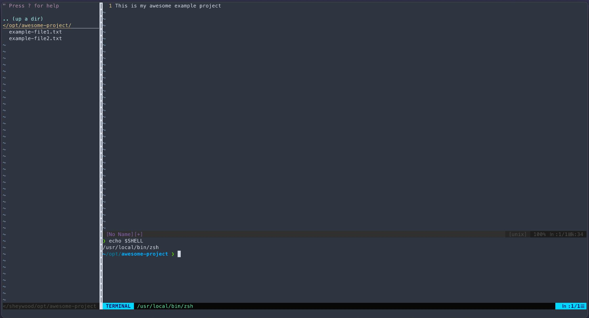
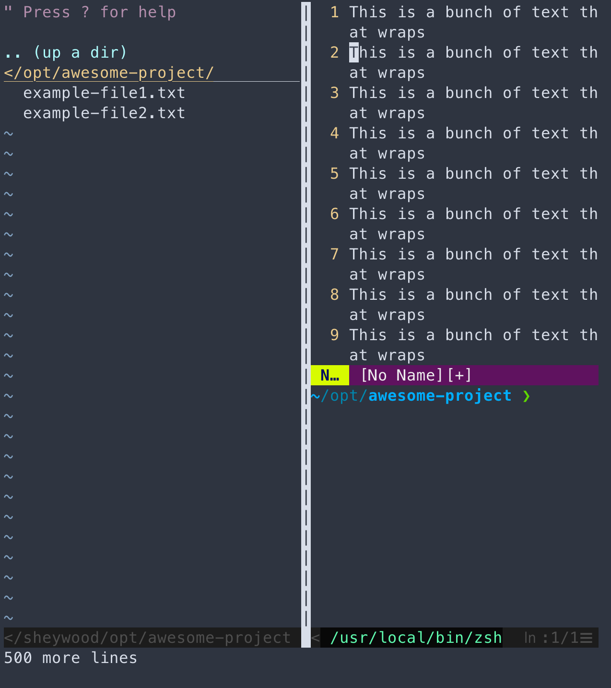
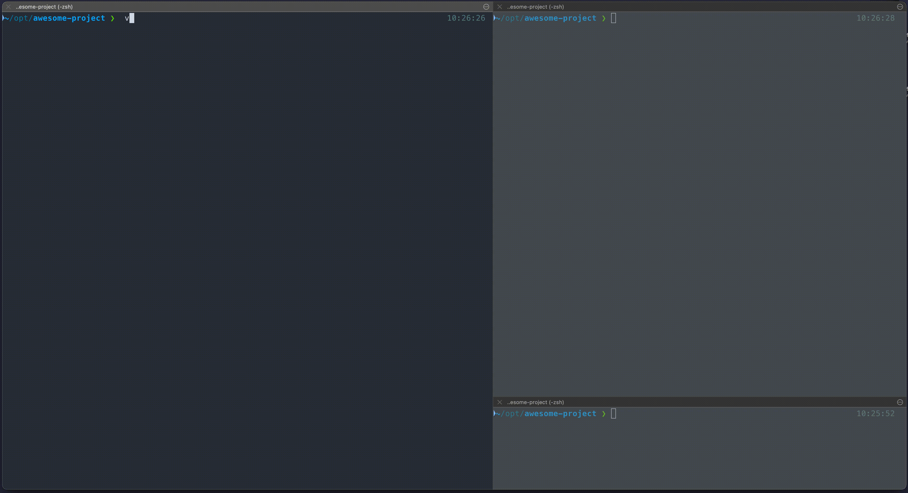

This will be a quick post on how I have configured my `vim` setup to adapt its interface based on detected screen size when it is first opened.

## The Problem: 

I like making `vim` look more like other IDE's with the [NERDTree](https://github.com/preservim/nerdtree) plugin and making a terminal appear at the bottom of my `vim` window whenever I launch `vim`. This setup looks great when `vim` is the only thing on my screen.

Here's what it looks like in fullscreen:



The problem arises when I opened it in a much smaller window. The terminal mode and NERDTree look terrible when I open `vim` when I am on a mobile display or just a smaller terminal window. The display gets a little crowded with NERDTree and terminal mode both opened.

Here's what it looks like when I would launch it in a smaller terminal window:



As you can see, NERDTree and the Terminal pane take up the majority of the space in `vim`.

## The Solution:

I added some configs to my `vimrc` file to only open NERDTree and terminal mode based on the detected `vim` window size:

```
" Start Nerdtree only if width is greater than or equal to 80 columns
if winwidth(0) >= 100
	" This will make NERDTree 1/6th of the detected vim window width
	let g:NERDTreeWinSize=winwidth(0)/6
	" This opens NERDTree when vim starts 
	autocmd VimEnter * NERDTree | wincmd p	
endif

" Start term only if height is greater than or equal to 35 rows
if winheight(0) >= 35
	" Set size of terminal mode
	set termwinsize=10x0
	set confirm
	" Put terminal mode on bottom of window
	set splitbelow
	" This opens terminal mode on vim start
	term ++kill=term
end
```

So now when I open `vim` it will not automatically open NERDTree or terminal mode if my `vim` window size is smaller than I think is comfortable for NERDTree or terminal mode.

Here's a gif of the result: 



In this gif I open `vim` in multiple terminal panes that are various sizes and based on my `vimrc` parameters it doesn't activate certain parts of my UI based on the `vim` window size. In the largest terminal pane it opens NERDTree and terminal mode. In the second largest pane it does not open NERDTree and only opens terminal mode. And in the smallest pane in my terminal it doesn't open NERDTree or terminal mode.


## Additional Resources:

[My vimrc](https://github.com/heywoodlh/conf/blob/abc34912f76e586691b340e68c06a928ef333d10/dotfiles/vimrc)

[The vim plugins I use](https://github.com/heywoodlh/conf/blob/abc34912f76e586691b340e68c06a928ef333d10/peru.yaml#L8-L21)

[stackoverflow -- VIM: how to get current window size, so that I can set NEEDTree to 1/3 window size?](https://stackoverflow.com/questions/42644591/vim-how-to-get-current-window-size-so-that-i-can-set-needtree-to-1-3-window-si)
