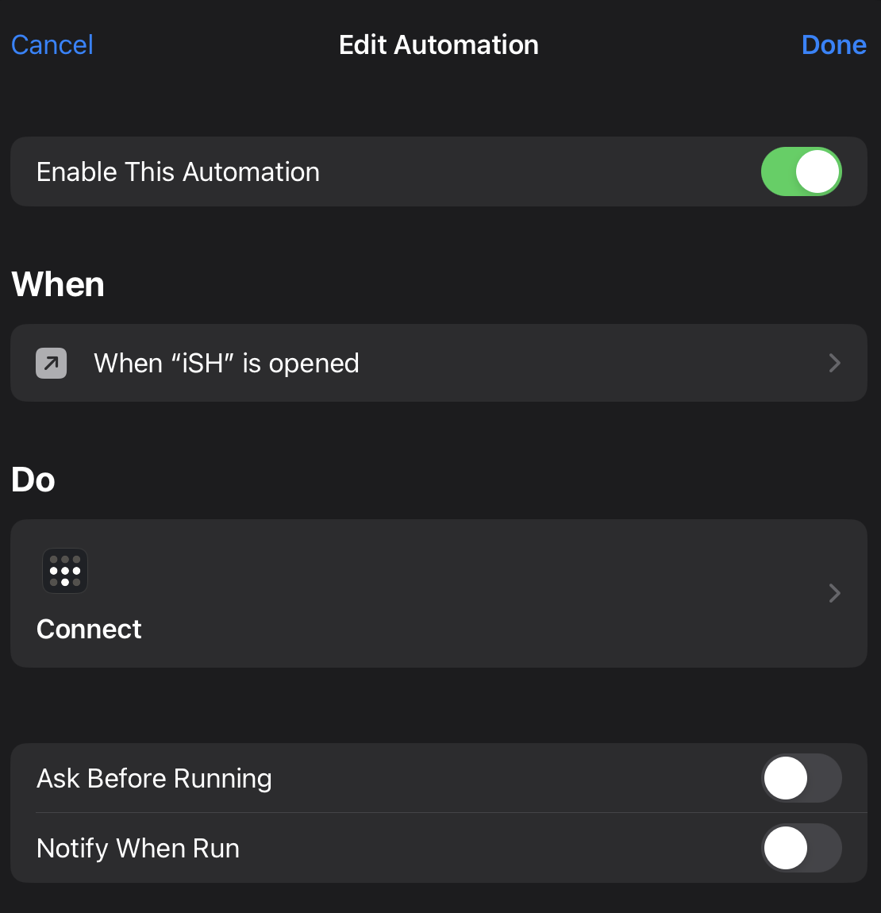
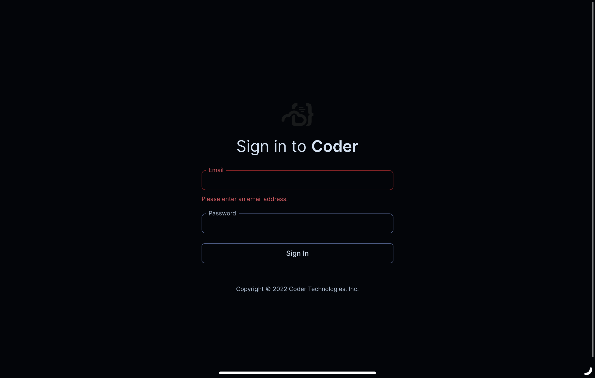
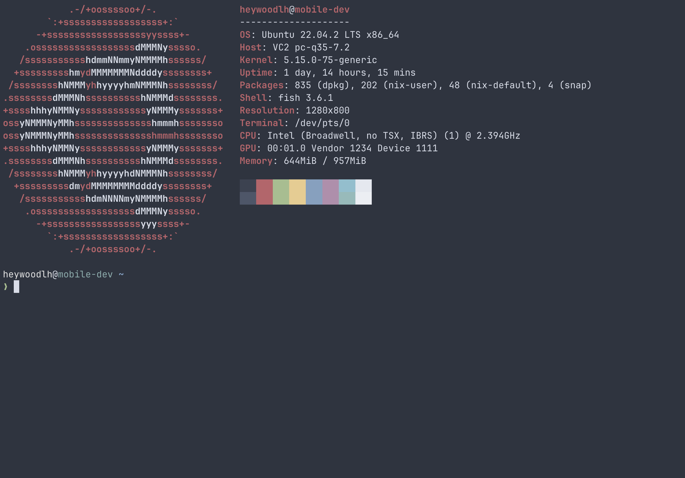

At Apple's 2023 WWDC event I found myself having a metaphorical, angry seizure because for yet another year my iPad Pro was still going to be a giant iPhone -- per the lack of features announced for iPadOS at the event.

I do a lot of Linux systems administration and development. The perceived shortcomings I project onto the iPad are likely very specific to me, so while the iPad might work extremely well for some, its featureset is limited for what I need and want.

This post is partly an opinion piece on the current state of the iPad for power users, but also an attempt to document some of the things I have been doing to make my iPad Pro actually useful to me.

P.S. I wrote this post from my iPad in Vim

## Why do I own an iPad?

I bought an M1 iPad Pro in 2021 thinking it was a fairly safe bet that the iPad Pro would eventually become a viable option for me as a laptop replacement. My reasons in 2021 for thinking it would become a laptop replacement were the following:
- Apple had recently announced iPadOS specifically for the iPad -- separating it from iOS
- The iPad Pro now shares the same processor as the Macs

Fast-forward to Apple's 2023 WWDC event where Apple announced almost no meaningful iPadOS updates that would help me better fulfill my goal of being able to use it for my laptop workflows. I'm not the ideal iPad user in Apple's approach because I use Linux often (for workstations and servers) and I want to do development on languages that are not Swift.

Here are the things I like about the iPad:
- I really like the form factor, combined with the Apple Magic keyboard case
- The battery life is good
- Compared to a laptop, the time I can get to doing things after opening the lid is much faster

Here are the downsides for me:
- Local development just isn't possible or limited
- iPadOS lacks extensibility/flexibility compared to other desktop operating systems (MacOS, Linux, Windows, etc.)
- Unfairly, on iOS/iPadOS Safari is the only browser that supports extensions
- Ultimately, iPadOS still feels pretty much just like iOS with some tweaks for iPad

So, let's get into how I try to adapt to iPadOS to lessen the impact of these perceived shortcomings.

## My assumptions

My assumptions for anyone finding this article useful are that you have an iPad Pro with an external keyboard of some sort. I prefer Apple's Magic Keyboard case (despite it being ridiculously expensive).

## Keyboard-driven workflows

On Linux and MacOS, I use a tiling window manager to automatically tile my opened applications. Pivotal to this workflow are keyboard shortcuts to make navigating the tiling windows and virtual workspaces possible.

### Use Spotlight for switching app focus/workspace switching

I recently observed a coworker using Spotlight on MacOS to not only launch applications but also to switch focus to already open application windows. This workflow not only works on MacOS, but also on iPadOS. This may seem "duh" to everyone, but for me, it was a revelation.

Start using Spotlight (invoked with Cmd + Space) not only to launch apps but to switch between already opened instances of apps.

### Use built-in app keyboard shortcuts

I have found that many apps on the iPad have a robust amount of keyboard shortcuts built into them. Whilst in any app on iPadOS, if you hold Cmd, an overlay will appear to show you all of the keyboard shortcuts built into the app.

Start using built-in keyboard shortcut for the apps you care about. I've found that most apps have the same keyboard shortcuts on the iPad as they do for their desktop apps. For example, the keyboard shortcuts for Slack in iPadOS mostly translate to comparable shortcuts on Slack in MacOS or Linux.

And again, if you're in doubt on your iPad as to what the shortcuts are in the app you're in, just hold Cmd.

### Use Stage Manager

I won't cover how to use Stage Manager, but it's basically a more complex window manager for iPadOS and MacOS. Enabling Stage Manager allows a user to have rules for windows and how they open.

Using Stage Manager can further enable keyboard-driven productivity.

### Safari

I don't use other browsers on my iPad because Apple unfairly restricts them in ways that Safari is not restricted.

There are a couple of things I do for being more keyboard-driven with Safari:
- Use the built-in keyboard shortcuts (in particular, the Cmd+L shortcut)
- Use the Vimlike Safari extension: https://apps.apple.com/us/app/vimlike/id1584519802

These tweaks make Safari a much more pleasant experience for me with being keyboard driven.

## Development tooling

### Apple Shortcuts

Apple Shortcuts supports a surprising amount of functionality. I would highly recommend using Apple Shortcuts to extend the programmability of your iPad.

As an example, check out this post where I use Apple Shortcuts on iOS to turn on/off a Paperspace VM for gaming: https://heywoodlh.io/paperspace-cloud-gaming-ios

### iSH

https://apps.apple.com/us/app/ish-shell/id1436902243

I use iSH to drastically extend the functionality of my iPad. iSH is an emulated x86 32-bit Alpine Linux environment that runs on iOS and iPadOS. Being able to run command line tools like `ssh`, `git`, `vim` or `dig` directly on my iPad has made my iPad far more functional.

I have a GitHub repository containing my iSH setup on my iPad: https://github.com/heywoodlh/ish-configs

### Tailscale

Tailscale is a user-friendly VPN service based on Wireguard. Although it is not itself specifically a tool for development, it enables me to remain always-connected to the infrastructure I use to support my iPad.

Seemingly, Tailscale does not have the ability to remain always on or use iOS' on-demand VPN featureset: https://github.com/tailscale/tailscale/issues/1534

The lack of always-on/on-demand VPN hasn't been an issue with me for Tailscale as I use an automation in Apple Shortcuts to turn on Tailscale when I'm in an app that would need to connect to servers in my Tailnet. For example, with iSH -- what I use to primarily SSH into my servers -- I have an Apple Shortcuts automation that will connect to Tailscale when I open the iSH app.

### Pomerium

Pomerium is also not a development tool -- it is an open source, identity-aware proxy. Similar to Tailscale, my Pomerium instance allows me to remotely access my personal infrastructure via HTTPS, and as a result, Pomerium enables me to be more productive in my development workflows on my iPad.

For example, here's my self-hosted Coder instance made available via my Pomerium instance:

### Dedicated Linux server

I have a small VPS running on Vultr that I can SSH into from my iPad that has all the tooling I need that I can't necessarily run on my iPad directly.

All of the tooling I am using on that server is configured for me via the cross-platform (MacOS, Linux) package manager [Nix](https://nixos.org). My Nix-managed tooling that I use on the server for my iPad is available here: https://github.com/heywoodlh/flakes

Here's a screenshot of me SSH-ed into my VM for my iPad, running `neofetch`:

## Conclusion

Hopefully these ideas are helpful to any sysadmin, developer or other power user who is also unhappy with the current out-of-the-box state of iPadOS. With the tweaks I've listed above, I find myself far more productive on my iPad.

But, maybe someday Apple will make the iPad more than just an iPhone that can work with a keyboard.
