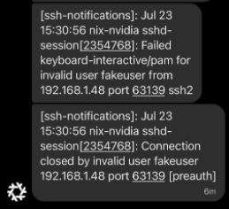
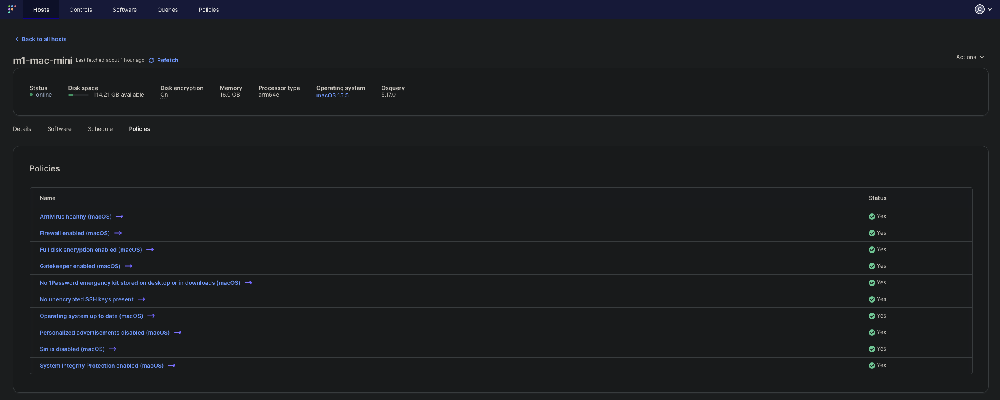
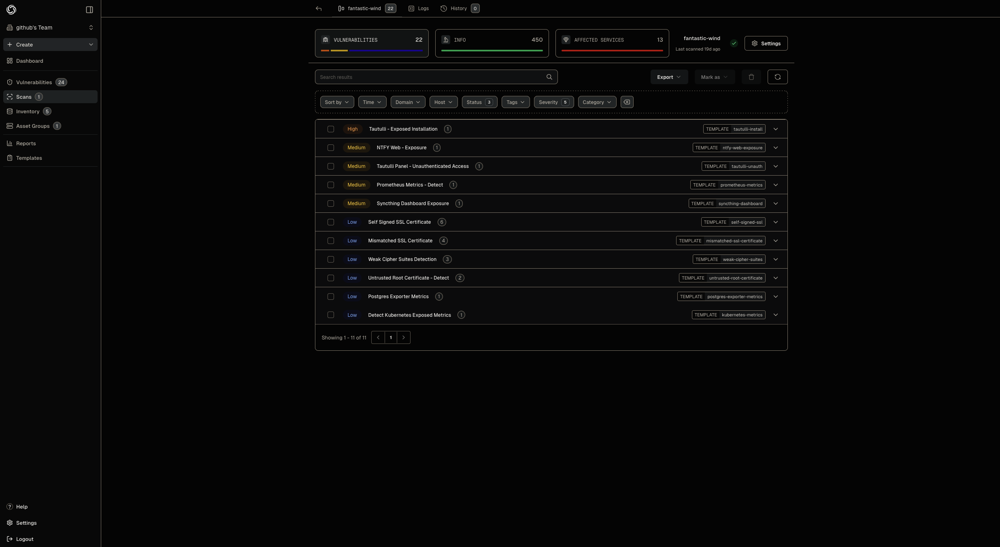
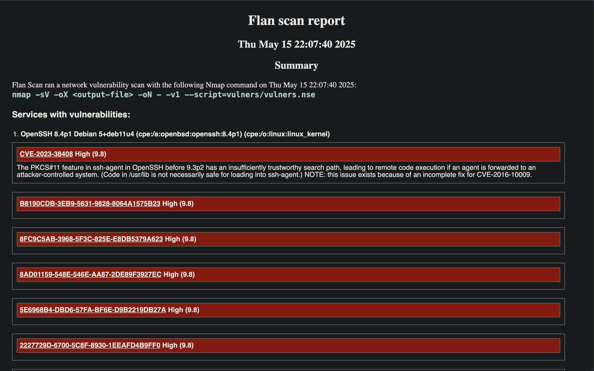

As someone with a career orbiting around security, I deeply enjoy finding effective security tools that are minimal. This post will serve as a index of what I'm doing for security monitoring at home at the time of writing. These tools are mostly all running in Kubernetes.

## Notification Infrastructure

It's important for significant security events to be made visible to administrators.

### NTFY

I use NTFY to receive push notifications -- although, as described below, I mirror those notifications to Signal.

NTFY deployment in Kubernetes: [ntfy.yaml](https://github.com/heywoodlh/flakes/blob/02d6a8c47b428331f634f866cad72b5e7134a930/kube/manifests/ntfy.yaml)

As an example, here is how I monitor all SSH login attempts on my NixOS servers with NTFY: [sshd-monitor.nix](https://github.com/heywoodlh/nixos-configs/blob/f3c35b13038cf37d8ab782cf5b0ac969ee78a7da/nixos/roles/security/sshd-monitor.nix)

### NTFY Signal Mirror

I wrote the following tool to mirror notifications I get in specific ntfy topics to Signal: [github:heywoodlh/signal-ntfy-mirror](https://github.com/heywoodlh/signal-ntfy-mirror)

I won't describe how it all works, but here's the NixOS implementation for those willing to figure it out themselves: [ntfy-signal.nix](https://github.com/heywoodlh/nixos-configs/blob/2ff872cb56e1734f738d3d26e0ccc1e4544440a4/nixos/roles/monitoring/ntfy-signal.nix)

The resulting Signal alert messages look like this:



## Logging

Good logging infrastructure is a critical security component.

### Syslog-ng

Syslog-ng, in my opinion, is the underrated GOAT of logging. It's minimal, yet can do so much.

Syslog-ng deployment in Kubernetes: [syslog.yaml](https://github.com/heywoodlh/flakes/blob/28c183bc2a1c4e75d1bd9caf1e6aa30f218e315c/kube/manifests/syslog.yaml)

The deployment also contains configurations for the following two tools to quickly search the logs:
- [logbash](https://github.com/heywoodlh/logbash)
- [lnav](https://github.com/tstack/lnav)

Here is how looking up failed SSH login attempts with my `logbash` deployment looks:

```
❯ logbash linux ssh-failed-login
/logs/linux/2025_07_23.log:Jul 23 21:30:56 ts-syslog-6d6kv-0 <86>1 2025-07-23T15:30:56-06:00 nix-nvidia sshd-session 2354768 - - Failed keyboard-interactive/pam for invalid user fakeuser from 192.168.1.48 port 63139 ssh2
/logs/linux/2025_07_23.log:Jul 23 21:30:56 ts-syslog-6d6kv-0 <86>1 2025-07-23T15:30:56-06:00 nix-nvidia sshd-session 2354768 - - Connection closed by invalid user fakeuser 192.168.1.48 port 63139 [preauth]
/logs/linux/2025_07_23.log:Jul 23 21:30:56 ts-syslog-6d6kv-0 <30>1 2025-07-23T15:30:56-06:00 nix-nvidia s7wypw6qzlva5z7m58zl2szjq7p0c1ks-sshd-monitor 2354781 - - {"id":"xvFYOYQpzn53","time":1753306256,"expires":1753349456,"event":"message","topic":"ssh-notifications","message":"Jul 23 15:30:56 nix-nvidia sshd-session[2354768]: Failed keyboard-interactive/pam for invalid user fakeuser from 192.168.1.48 port 63139 ssh2"}
/logs/linux/2025_07_23.log:Jul 23 21:30:56 ts-syslog-6d6kv-0 <30>1 2025-07-23T15:30:56-06:00 nix-nvidia s7wypw6qzlva5z7m58zl2szjq7p0c1ks-sshd-monitor 2354785 - - {"id":"hOCAbts9lJ6X","time":1753306256,"expires":1753349456,"event":"message","topic":"ssh-notifications","message":"Jul 23 15:30:56 nix-nvidia sshd-session[2354768]: Connection closed by invalid user fakeuser 192.168.1.48 port 63139 [preauth]"}
```

### Syslog-ng to NTFY alert/notification

I want to draw special attention to the fact that syslog-ng can run actions on specific matches. This is especially powerful when you want certain log messages to trigger events.

In my case, I want specific logs to trigger NTFY alerts. I couldn't find any reference examples when trying to set this up, so I hope this saves anybody wanting to do this some time.

Here's a snippet from my syslog-ng configuration that triggers an NTFY notification on a match:

```
source unifi_remote {
  udp(ip(0.0.0.0) port(514));
};

destination ntfy {
  http(
    url("http://ntfy.default.svc.cluster.local/security-notifications")
    method("POST")
    user-agent("syslog-ng User Agent")
    headers("Title: syslog-ng alert ${HOST}")
    body("${ISODATE} ${MESSAGE}")
  );
};

# All noteworthy ssh events
filter ssh_events {
  message("(Failed password|Invalid verification code|Invalid user|Accepted publickey|Accepted password|Accepted keyboard-interactive|Failed keyboard-interactive).*");
};

# unifi ssh notifications
log {
  source(unifi_remote);
  filter(ssh_events);
  destination(ntfy);
};
```

## Endpoint monitoring

I use a handful of tools for monitoring my servers and workstations.

### Using FleetDM Policies for determining endpoint posture

[FleetDM](https://fleetdm.com/) is an open source endpoint monitoring solution built around [OSQuery](https://www.osquery.io/). OSQuery is perhaps the only solution I know of wherein one can get the state of a machine _without_ administrative shell access and with minimal invasion of privacy.

FleetDM deployment in Kubernetes: [fleetdm.yaml](https://github.com/heywoodlh/flakes/blob/7ac7f166e0856b7a63e226f8dccb0b0b20ad41c4/kube/manifests/fleetdm.yaml)

### MacOS FleetDM configuration

Installation of the `fleetctl`-generated installer for MacOS, hosted on a web server in my Tailnet: [base.nix](https://github.com/heywoodlh/nixos-configs/blob/90fed4b193d3c5b6556c9dddb8cb766787142c5a/darwin/roles/base.nix#L58-L73)

As a Nix-Darwin and Home-Manager here's where I configure my Mac relevant to Fleet:
- Fleet installation: [github:heywoodlh/nixos-configs -- darwin/roles/base.nix#L62-77](https://github.com/heywoodlh/nixos-configs/blob/d5e3e32444409b5f2d6eb388b45f32f8e3e03c85/darwin/roles/base.nix#L62-L77)
- Defaults implementation: [github:heywoodlh/nixos-configs -- home/modules/darwin-defaults.nix](https://github.com/heywoodlh/nixos-configs/blob/d5e3e32444409b5f2d6eb388b45f32f8e3e03c85/home/modules/darwin-defaults.nix)

And, here's how the Macs show up on Fleet after they are configured:



### Linux configuration

NixOS configuration for OSQuery: [osquery.nix](https://github.com/heywoodlh/nixos-configs/blob/a88939bae4f576690b2e8b26e70e47cfea96490f/nixos/roles/monitoring/osquery.nix)

Ubuntu servers installing the FleetDM generated package with Ansible: [security.yml](https://github.com/heywoodlh/flakes/blob/3a7ca920470bfea0697728886f4451335a5cf8bd/ansible/server/tasks/linux/security.yml#L130-L146)

## Vulnerability scanning

I have at least two solutions for vulnerability scanning at the time of writing.

### Nuclei for web scanning

I use [Nuclei from Project Discovery](https://projectdiscovery.io/nuclei) for automated vulnerability scanning in my cluster.

Nuclei deployment in Kubernetes: [nuclei.yaml](https://github.com/heywoodlh/flakes/blob/28c183bc2a1c4e75d1bd9caf1e6aa30f218e315c/kube/manifests/nuclei.yaml)

The features in my deployment are the following:
- Automatic enumeration of Kubernetes services as targets for Nuclei to scan
- Upload of results to projectdiscovery.io's dashboard



### Flan Scan (nmap + vulners) for network vulnerability scanning

For a simple, less web-focused vulnerability scan, I use Cloudflare's [Flan scanner](https://github.com/cloudflare/flan) which is as a wrapper around `nmap` and the `vulners` script that produces a report of the findings.

Flan scan deployment in Kubernetes: [flan-scan.yaml](https://github.com/heywoodlh/flakes/blob/02d6a8c47b428331f634f866cad72b5e7134a930/kube/manifests/flan-scan.yaml)


